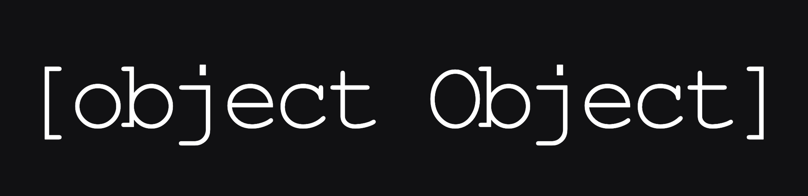

<<<<<<< HEAD
=======
# object-object

>>>>>>> 1fe45e89c781db49e165568ed2ecf0b30f3932da

### 
[object Object] - A utility bot for programmers

    
    
    
    

---

## About

We all know that programmers are pretty lazy, I mean, if you're looking at this repo, that's proof already.
So we decided to create a Discord bot that would take care of your listless programming needs.

Nearly all commands are utilities to speed up your development process or to help you stay on Discord and never open a new tab.

-   Want to Google something but too lazy to open a new tab? We've got a command for that.

-   Want to search questions on Stack Overflow? We've got a command for that.

-   Want to stalk people on GitHub by looking at their repositoryies? **We've got a command for that.**

Invite the bot [here](https://discord.com/oauth2/authorize?client_id=839151235860004894&scope=bot&permissions=8) to try it out, and see if it makes your life a little easier!

## Commands

| Command   | Description                                                      |
| --------- | ---------------------------------------------------------------- |
| disable   | Disables a command.                                              |
| enable    | Enables a command.                                               |
| docs      | Fetches documentation from discord.js or MDN.                    |
| exec      | Executes some code in a codeblock.                               |
| format    | Formats your spaghetti code.                                     |
| ghraw     | Generates the raw GitHub user content link for a file on GitHub. |
| google    | Searches google.                                                 |
| jq        | Manipulates JSON data with `node-jq`.                            |
| languages | Shows you information on many leading languages                  |
| npm       | Searches npm for packages.                                       |
| repo      | Fetches a GitHub repository.                                     |
| stack     | Fetches Stack Overflow questions.                                |
| tag       | Manage or retrieve tags to display tidbits of info quickly       |

###### An entry for the <a href="https://discord.gg/8KbMUMqPuR">Worn Off Keys</a> programming competition of May 2021.
